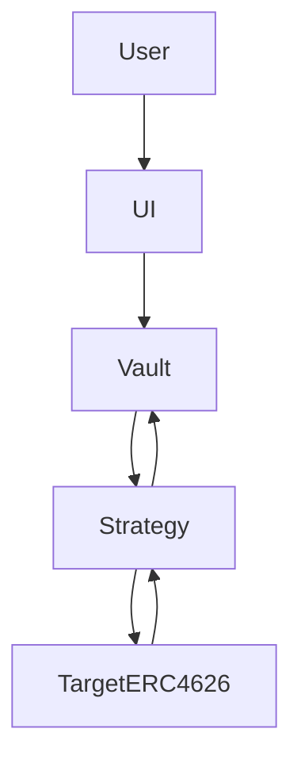

# README.md — Trellis Vaults (Latest‑First)

**Trellis Vaults** is a secure, modular **ERC‑4626 yield vault** dApp for **Base**. Start with **one USDT vault** routed to **Euler v2 Earn (ERC‑4626)** if available; otherwise **USDC**. Add more vaults via adapters (Aave v3, Compound v3/Comet, Morpho).

## Features

* **ERC‑4626 vault** with predictable accounting
* **Pluggable strategies** (start with ERC‑4626 adapter for Euler v2)
* **10% performance fee** on profits via **fee shares** + high‑water mark
* **Pausable, Reentrancy‑safe, Ownable**
* **Next.js (latest)** + **RainbowKit/wagmi/viem** UI

## Architecture

* **Vault** holds underlying (USDT or USDC). `afterDeposit` → Strategy; `beforeWithdraw` pulls liquidity back.
* **StrategyERC4626** wraps any ERC‑4626 target vault (e.g., Euler v2 Earn); target upgradable by owner.
* **Keeper** periodically calls `harvest()` (profit or time‑based).



## Tech Stack (Latest‑First)

* **Contracts:** Solidity ^0.8.20, Foundry (latest), OpenZeppelin (latest)
* **Frontend:** Next.js (latest), React (latest), TypeScript, Tailwind + shadcn/ui, RainbowKit + wagmi + viem
* **CI:** GitHub Actions • **Lint/Format:** ESLint, Prettier, Solhint

## Bootstrap

### Option A — Scaffold‑ETH 2 (recommended)

```bash
pnpm dlx create-eth@latest trellis
# Choose Foundry
cd trellis
pnpm i
pnpm dev   # frontend
pnpm chain # local node
pnpm deploy
```

### Option B — From Scratch (Next.js + RainbowKit)

```bash
pnpm dlx create-next-app@latest trellis-frontend
cd trellis-frontend
pnpm create @rainbow-me/rainbowkit@latest
pnpm i
pnpm dev
```

> The project uses a **monorepo layout** (`contracts/`, `frontend/`, `ops/`, `docs/`). If Option A creates a different structure, keep it and adapt paths, but retain the logical separation.

## Contracts — Quick Start

```bash
cd contracts
forge install
forge build
forge test -vvv
```

### Env

```
# Base
RPC_URL=https://mainnet.base.org
DEPLOYER_PK=0x...
OWNER=0xYourOpsMultisig
FEE_RECIPIENT=0xYourRevenueWallet
ASSET_TOKEN=0xAssetOnBase   # USDT preferred; else USDC
TARGET_ERC4626=0xTargetVault # Euler v2 vault (matching underlying)
```

### Deploy

```bash
forge script script/Deploy.s.sol:Deploy \
  --rpc-url $RPC_URL --broadcast --verify
```

## Frontend — Quick Start

```bash
cd frontend
pnpm i
pnpm dev
```

Create `.env.local`:

```
NEXT_PUBLIC_NETWORK=base
NEXT_PUBLIC_RPC_URL=https://mainnet.base.org
```

## Theme & UX

* Dark default with **Trellis green** accent.
* Tailwind tokens: `--bg: #0b0f10`, `--muted: #0f1517`, `--accent: #22c55e`, `--text: #e6f1ee`
* Components: rounded‑2xl cards, soft shadows, motion micro‑interactions.

## Adding a New Vault (Playbook)

1. Verify ERC‑4626 target & underlying match (prefer USDT → else USDC).
2. Deploy new Vault + Strategy; call `setStrategy`; verify and record addresses.
3. Frontend: add vault config (name/icon/addresses/caps/decimals).
4. Keeper: include in harvest schedule.
5. Docs: update diagrams; append **LOG.md** with details.

## Operations

* **Harvest policy:** time‑based (e.g., every 24h) or profit threshold (fee value > gas).
* **Pause runbook:** pause; `withdrawAll` from strategy; communicate status; postmortem in **LOG.md**.

## Security Notes

* No fee on loss; fee shares only on profit.
* `sweep()` blocked for underlying.
* Separate `owner` and `feeRecipient`.

## Documentation Discipline

* Update **README.md** and **LOG.md** after **every** material change.
* Include version audit (Next, wagmi, RainbowKit, viem, Node) in each **LOG.md** entry.

## Roadmap

* Adapters: Aave v3, Compound v3 (Comet), Morpho Blue
* UI: activity feed, caps, APR slot
* Monitoring: health checks + alerts

## Name & License

* **Name:** Trellis Vaults
* **License:** MIT
